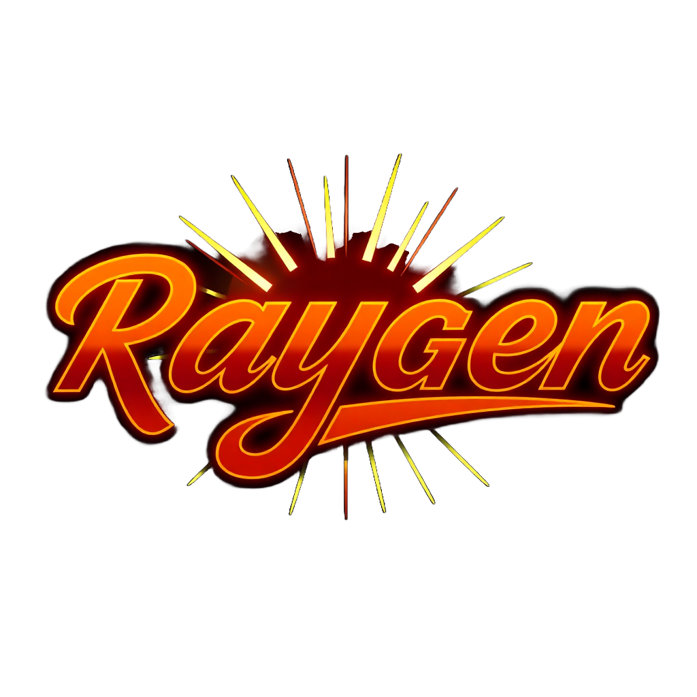

<a id="readme-top"></a>

<!-- PROJECT SHIELDS -->
[![Contributors][contributors-shield]][contributors-url]
[![Forks][forks-shield]][forks-url]
[![Stargazers][stars-shield]][stars-url]
[![Issues][issues-shield]][issues-url]
[![License][license-shield]][license-url]
[![LinkedIn][linkedin-shield]][linkedin-url]

<!-- PROJECT LOGO -->
<br />
<div align="center">
  <a href="https://github.com/LandryTech/Raygen">
    
  </a>

  <h3 align="center">Raygen</h3>

  <p align="center">
    Raygen is a performant and extensible 2D raycasting engine built in Java, designed for rendering dynamic environments with a classic pseudo-3D perspective. Utilizing the JFrame library for graphical output, Raygen implements an efficient raycasting algorithm to simulate depth perception, making it ideal for games, simulations, and educational projects.
    <br /><br />
    <strong>Key Features:</strong><br />
    <strong>Real-Time Rendering</strong> – Uses a raycasting technique to generate a first-person perspective view.<br />
    <strong>Smooth Player Movement</strong> – Supports full 2D motion, and rotational movement via mouse movement.<br />
    <strong>Custom Input Handling</strong> – Implements an <code>InputHandler</code> class for responsive user interaction.<br />
    <strong>Scalable and Modular</strong> – Easily extendable for new gameplay mechanics, textures, and enhancements.<br />
    <strong>Dynamic Collision Detection</strong> – Utilizes a <code>CollisionManager</code> to prevent player movement through walls.<br />
    <strong>Customizable Settings</strong> – Allows adjustment of FOV, render distance, player speed, and collision tolerance via an in-game settings menu.<br />
    <br />
    Whether you're exploring the fundamentals of computer graphics or developing a retro-style game, Raygen provides a solid foundation for 2D raycasting in Java.
    <br />
    <br />
    <a href="https://github.com/LandryTech/Raygen"><strong>Explore the docs »</strong></a>
    <br />
    <br />
    <a href="https://github.com/LandryTech/Raygen">View Demo</a>
    &middot;
    <a href="https://github.com/LandryTech/Raygen/issues/new?labels=bug&template=bug-report---.md">Report Bug</a>
    &middot;
    <a href="https://github.com/LandryTech/Raygen/issues/new?labels=enhancement&template=feature-request---.md">Request Feature</a>
  </p>
</div>

<!-- TABLE OF CONTENTS -->
<details>
  <summary>Table of Contents</summary>
  <ol>
    <li><a href="#about-the-project">About The Project</a></li>
    <li><a href="#built-with">Built With</a></li>
    <li><a href="#usage">Usage</a></li>
    <li><a href="#top-contributors">Top Contributors</a></li>
    <li><a href="#license">License</a></li>
    <li><a href="#contact">Contact</a></li>
    <li><a href="#acknowledgments">Acknowledgments</a></li>
  </ol>
</details>

<!-- ABOUT THE PROJECT -->
## About The Project

Raygen is a 2D raycasting engine written in Java, using JFrame for rendering and an efficient raycasting algorithm for depth simulation. It is designed for game development, simulations, and educational purposes. The engine features real-time rendering, smooth player movement, and dynamic collision detection, making it a versatile tool for creating immersive 2D environments with a pseudo-3D effect.

### Built With

<a href="https://www.java.com/en/">
  
</a>

* JFrame
* Java AWT
* Java Swing

<!-- USAGE -->
## Usage

Raygen is designed to be easy to use and extend. Here's a quick guide to get started:

1. **Clone the Repository**:
   ```bash
   git clone https://github.com/LandryTech/Raygen.git
2. **Run the Application**:
   * Navigate to the project directory and run the <code>Raygen</code> class.
   * The game will start with a map selection menu where you can choose from predefined maps.
3. **Controls**:
   * **W**: Move forward
   * **S**: Move backwards
   * **A**: Strafe left
   * **D**: Strafe right
   * **Mouse Movement**: Rotate the player's view
   * **Space**: Open the settings menu to adjust FOV, render distance, and player speed through the in-game settings menu.
<!-- TOP CONTRIBUTORS -->
## Top Contributors

<a href="https://github.com/LandryTech/Raygen/graphs/contributors">
  
</a>

<!-- ACKNOWLEDGMENTS -->
## Acknowledgments
* **Java AWT and Swing**: For providing the graphical framework used in this project.
* **Raycasting Algorithm**: Inspired by classic raycasting techniques used in the early 3D games like Wolfenstein 3D.
* **Open Source Community**: For continuous inspiration.


<!-- LICENSE -->
## License

Distributed under the **GPL License 3.0**. See `LICENSE.txt` for more information.

<!-- CONTACT -->
## Contact

Kaden Landry - [Kaden L. LinkedIn](https://www.linkedin.com/in/kadenlandry)<br />
Zachary Beaupre <br />
Pablo Artero - [Pablo S. LinkedIn](https://www.linkedin.com/in/pablo-artero-sanrom%C3%A1n-8995382bb/)<br />

Project Link: [https://github.com/LandryTech/Raygen](https://github.com/LandryTech/Raygen)

<!-- MARKDOWN LINKS & IMAGES -->
[contributors-shield]: https://img.shields.io/github/contributors/LandryTech/Raygen.svg?style=for-the-badge
[contributors-url]: https://github.com/LandryTech/Raygen/graphs/contributors
[forks-shield]: https://img.shields.io/github/forks/LandryTech/Raygen.svg?style=for-the-badge
[forks-url]: https://github.com/LandryTech/Raygen/network/members
[stars-shield]: https://img.shields.io/github/stars/LandryTech/Raygen.svg?style=for-the-badge
[stars-url]: https://github.com/LandryTech/Raygen/stargazers
[issues-shield]: https://img.shields.io/github/issues/LandryTech/Raygen.svg?style=for-the-badge
[issues-url]: https://github.com/LandryTech/Raygen/issues
[Java.com]: https://i.postimg.cc/wjXGLGbJ/java-icon-logo.jpg
[Java-url]: https://www.java.com/en/
[license-shield]: https://img.shields.io/github/license/LandryTech/Raygen.svg?style=for-the-badge
[license-url]: https://github.com/LandryTech/Raygen/blob/master/LICENSE.txt
[linkedin-shield]: https://img.shields.io/badge/-LinkedIn-black.svg?style=for-the-badge&logo=linkedin&colorB=555
[linkedin-url]: https://www.linkedin.com/in/kaden-landry-661506309/
